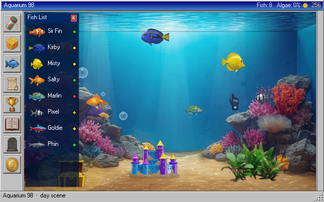
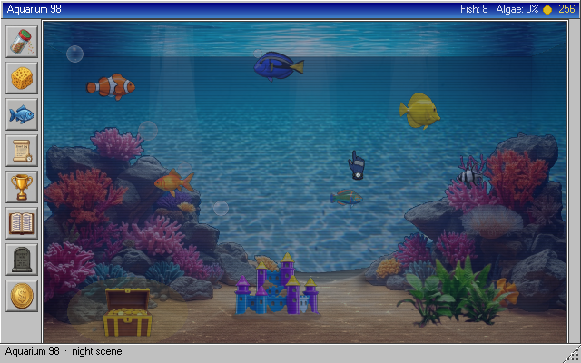
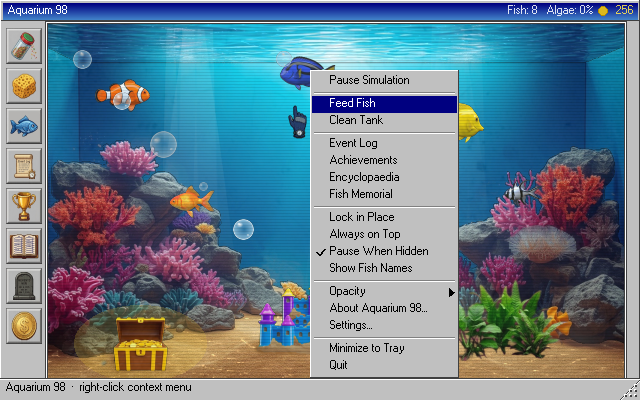
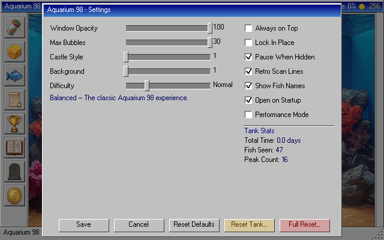

# Aquarium 98

<p align="center">
  
</p>

[](https://github.com/trumanac/Aquarium98/actions/workflows/ci.yml)
[](LICENSE)
[](https://www.python.org/downloads/)
[](#quick-start-from-source)

A retro Windows 98-styled desktop aquarium widget — a living, breathing fish tank that lives on your desktop. Cross-platform Python app built with pygame-ce, targeting **≤1% CPU** as a true always-on background companion.

## Screenshots

| Day scene | Night scene |
|:---------:|:-----------:|
|  |  |

| Right-click menu | Settings dialog |
|:----------------:|:---------------:|
|  |  |

## Download

The latest release is available on the [Releases page](../../releases/latest).

| Platform | Download |
|----------|----------|
| Windows  | `Aquarium98-vX.X.X.zip` |
| macOS    | `Aquarium98-vX.X.X.zip` |
| Linux    | `Aquarium98-vX.X.X.zip` |

Unzip and run — no Python installation required. Each release also includes a `.sha256` checksum file so you can verify your download.

## Quick Start (from source)

**Windows:** double-click `run.bat`  
**macOS:** double-click `run.command`  
**Linux:** `./run.sh`

First launch creates a local `.venv`, installs dependencies (~30s), and starts the app. Every launch after that is instant.

**Requirements (source only):**
- Python **3.9** or newer
- **Linux** system tray: `sudo apt install libappindicator3-1 gir1.2-appindicator3-0.1` (Ubuntu/Debian) or equivalent. App runs without it — just no tray icon.

## Features

### 35 Unique Species
Your tank can hold up to 18 fish drawn from a roster of 35 species across four rarity tiers:

| Rarity | Count | Examples |
|--------|-------|---------|
| Common | 16 | Clownfish, Neon Tetra, Guppy, Angelfish, Betta, Puffer … |
| Uncommon | 10 | Kuhli Loach, Honey Gourami, Amano Shrimp, African Dwarf Frog … |
| Rare | 9 | Dragon Goby, Hermit Crab, Moonveil Dart, Prism Dancer … |
| Super Rare | 1 | Pearl Rasbora |

Fish breed naturally, age, and eventually pass on. Bottom-dwellers crawl the sand, algae eaters cling to the glass, and schooling fish flock together.

### Coin Economy & Fish Shoppe
- Earn coins by feeding fish, popping bubbles, opening treasure chests, and completing achievements
- Spend coins in the **Fish Shoppe** to buy new species (prices vary by rarity)
- Sell fish you no longer want for a partial refund

### Treasure Chest
A chest on the tank floor opens periodically — click it to collect coins and trigger a bubble burst.

### Panels & UI
- **Fish Encyclopaedia** — tracks all 35 species; unseen entries show as silhouettes until discovered
- **Fish Roster** — live table of every fish in the tank with health, hunger, and mood
- **Fish Profile** — click any fish for a detailed popup with stats and fun facts
- **Event Log** — timestamped history of everything that happens in the tank
- **Achievements** — 20+ milestones rewarding exploration and longevity
- **Graveyard** — memorial log of every fish that has died
- **Settings** — sliders and checkboxes for opacity, fish counts, time scale, hunger/breed/algae rates, background style (4 options), plant style (3 options), castle/decor style (7 options), and more

### Custom Animated Cursors
- Diving glove cursor by default
- Fish food shaker cursor in Feed mode
- Cleaning sponge cursor in Clean mode
- Each cursor has a 5-frame click animation

### Win98 Aesthetic
Authentic Windows 98 chrome, beveled panels, gradient title bars, scan-line overlay, and a system tray icon. Resize and reposition the window freely; lock it in place when you're happy. A splash screen greets you on every launch.

### Randomised Decor
Every new tank or reset picks a fresh castle/decor from 7 options (four castle variants, a pirate ship, and more). You can always override the choice in Settings.

## Controls

| Action | Input |
|--------|-------|
| Context menu | Right-click anywhere |
| Drop food / scrub algae | Left-click in tank (when mode active) |
| Toggle Feed mode | Toolbar feed button or **F** |
| Toggle Clean mode | Toolbar clean button or **C** |
| Pause / Resume | **Space** |
| Open Settings | **E** |
| Minimize to tray | **Esc** |
| Quit | **Ctrl+Q** |
| Move window | Drag title bar |
| Resize | Drag bottom-right corner |

## Right-Click Menu

| Option | Description |
|--------|-------------|
| Pause Simulation | Freeze all fish, bubbles, and effects |
| Feed Fish | Scatter food across the surface |
| Clean Tank | Scrub algae from the glass |
| Event Log | Scroll through tank history |
| Achievements | View unlocked milestones |
| Encyclopaedia | Browse every species and fun facts |
| Fish Memorial | A graveyard for lost fish |
| Lock in Place | Prevent accidental window moves |
| Always on Top | Keep the tank above all other windows |
| Pause When Hidden | Stop simulation when minimised |
| Show Fish Names | Display each fish's name above them |
| Opacity | Set window transparency (100% – 30%) |
| About Aquarium 98 | Version and credits |
| Settings | Full settings panel |
| Minimize to Tray | Send to system tray |
| Quit | Exit the application |

## Building a Release

```
python build.py --version 1.0.0
```
Outputs `dist/Aquarium98-v1.0.0.zip` and `dist/Aquarium98-v1.0.0.zip.sha256`.

To publish a GitHub Release automatically:
1. Push your changes.
2. Go to **Actions → Build & Release → Run workflow**.
3. Enter the version number (e.g. `1.2.0`) and click **Run workflow**.

The workflow smoke-tests on Windows, macOS, and Linux before publishing.

## Credits

Created by **[trumanac](https://github.com/trumanac)**.

## License

Copyright © 2026 [trumanac](https://github.com/trumanac). All Rights Reserved.

Aquarium 98 is **free to download and play** for personal, non-commercial use.
You may **not** sell it, redistribute it, or use it in a commercial product.
See [LICENSE](LICENSE) for the full terms.
