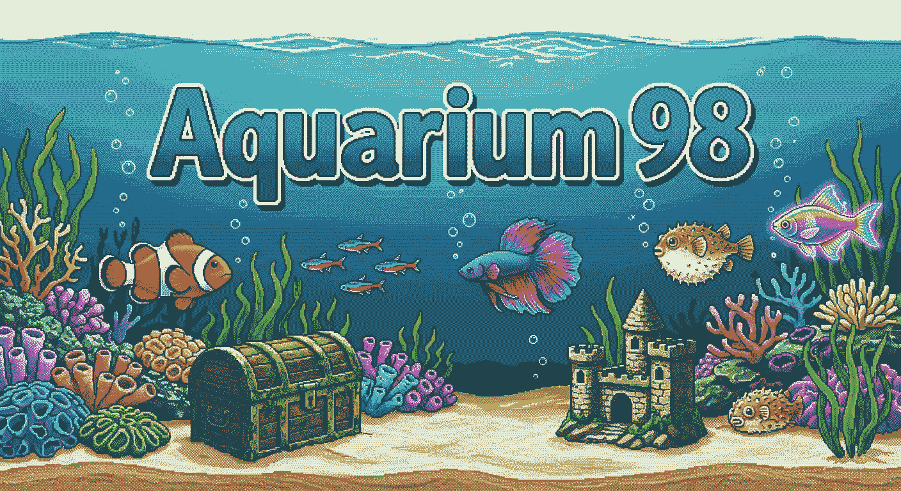
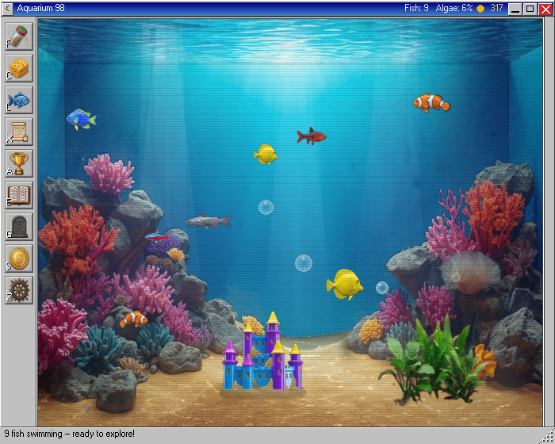
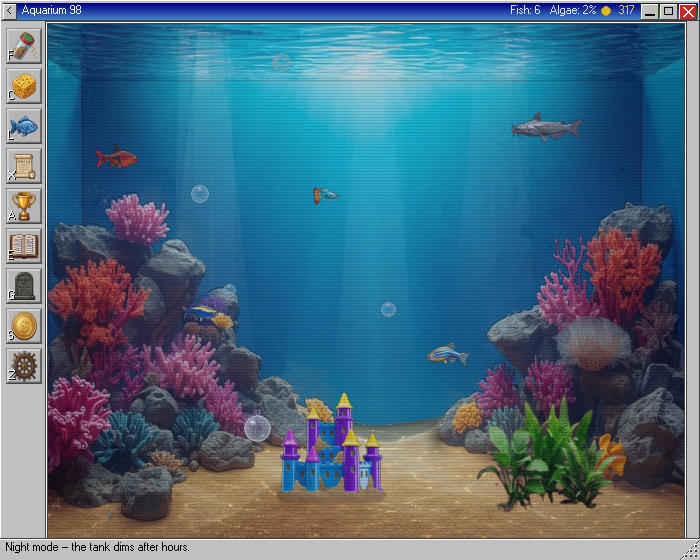
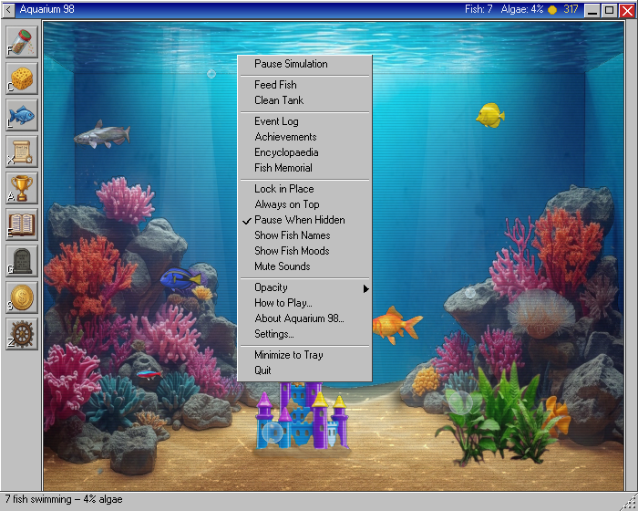
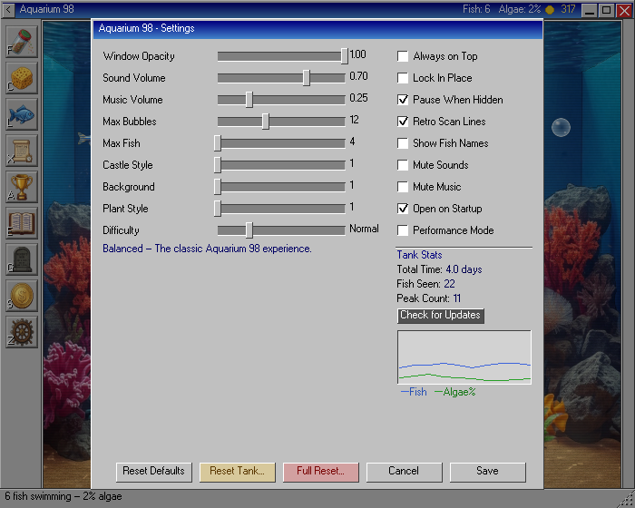

# Aquarium 98

<p align="center">
  
</p>

[](https://github.com/trumanac/Aquarium98/releases/latest)
[](https://github.com/trumanac/Aquarium98/releases)
[](https://superbirdy.itch.io)
[](LICENSE)
[](#download)

A retro Windows 98-styled desktop aquarium widget — a living, breathing fish tank that lives on your desktop. Cross-platform Python app built with pygame-ce, targeting **≤1% CPU** as a true always-on background companion.

## Screenshots

| Day scene | Night mode |
|:---------:|:----------:|
|  |  |

| Right-click menu | Settings dialog |
|:----------------:|:---------------:|
|  |  |

## Download

> No Python required. Grab the file for your OS and run it.

| Platform | One-click download | Notes |
|----------|--------------------|-------|
| **Windows 10 / 11** (64-bit) | [⬇ Aquarium98-Setup.exe](https://github.com/trumanac/Aquarium98/releases/latest/download/Aquarium98-Setup.exe) | Installer — no admin required |
| **macOS** 10.15 Catalina+ | [⬇ Aquarium98.dmg](https://github.com/trumanac/Aquarium98/releases/latest/download/Aquarium98.dmg) | Open DMG, drag to Applications |
| **Linux** (x86\_64) | [⬇ Aquarium98-x86\_64.AppImage](https://github.com/trumanac/Aquarium98/releases/latest/download/Aquarium98-x86_64.AppImage) | Portable — no install needed |

SHA256 checksums for every file are on the [Releases page](https://github.com/trumanac/Aquarium98/releases/latest).

<details>
<summary><b>Windows</b> — SmartScreen warning on first run</summary>

Windows may show *"Windows protected your PC"* the first time you run the installer.
Click **More info → Run anyway**. This is expected for apps without a paid code-signing
certificate. The app is safe.

</details>

<details>
<summary><b>macOS</b> — Gatekeeper &amp; "app is damaged" message</summary>

macOS blocks apps from unidentified developers by default. On first launch, choose one:

- Right-click the `.app` → **Open** → **Open** (one-time prompt)
- Or run in Terminal:
  ```bash
  xattr -dr com.apple.quarantine /Applications/Aquarium98.app
  ```

</details>

<details>
<summary><b>Linux</b> — mark executable + optional system tray</summary>

```bash
chmod +x Aquarium98-x86_64.AppImage
./Aquarium98-x86_64.AppImage
```

For system-tray support on Ubuntu / Debian:
```bash
sudo apt install libayatana-appindicator3-1
```

The app runs without the tray library — you just won't get the tray icon.

</details>

## Quick Start (from source)

**Windows:** double-click `run.bat`  
**macOS:** double-click `run.command`  
**Linux:** `./run.sh`

First launch creates a local `.venv`, installs dependencies (~30s), and starts the app. Every launch after that is instant.

### macOS (Unsigned Release) Quick Setup

If macOS blocks launch because the app is unsigned, use this copy/paste setup in Terminal:

```bash
# 1) Change this path if you unzipped somewhere else
cd /Applications/Aquarium98

# 2) Ensure launchers are executable
chmod +x run.command run.sh

# 3) Remove Gatekeeper quarantine flags from the unzipped folder
xattr -dr com.apple.quarantine .

# 4) Launch
./run.command
```

If `run.command` is blocked, open **System Settings → Privacy & Security** and click **Open Anyway**, then launch again.

**Requirements (source only):**
- Python **3.9** or newer
- **Linux** system tray: `sudo apt install libappindicator3-1 gir1.2-appindicator3-0.1` (Ubuntu/Debian) or equivalent. App runs without it — just no tray icon.

## Features

### 35 Unique Species
Your tank can hold up to 18 fish (Peaceful mode; scales down to 10 on Nightmare) from a roster of 35 species across four rarity tiers:

| Rarity | Count | Examples |
|--------|-------|---------|
| Common | 16 | Clownfish, Neon Tetra, Guppy, Algae Eater, Cardinal, Zebra Danio … |
| Uncommon | 10 | Angelfish, Kuhli Loach, Honey Gourami, Hermit Crab, Puffer … |
| Rare | 8 | Dragon Goby, Moonveil Dart, Prism Dancer, Golden Specter … |
| Epic | 1 | Moonshell Hermit |

Fish breed naturally, age, and eventually pass on. Bottom-dwellers crawl the sand, algae eaters cling to the glass, and schooling fish flock together.

### Coin Economy & Fish Shoppe
- Earn coins by feeding fish, popping bubbles, opening treasure chests, and completing achievements
- Spend coins in the **Fish Shoppe** to buy new species (prices vary by rarity)
- Sell fish you no longer want for a partial refund

### Treasure Chest
A chest on the tank floor opens periodically — click it to collect coins and trigger a bubble burst.

### Panels & UI
- **Fish Encyclopaedia** — tracks all 35 species; unseen entries show as silhouettes until discovered
- **Fish Roster** — live table of every fish in the tank with health, hunger, and mood
- **Fish Profile** — click any fish for a detailed popup with stats and fun facts
- **Event Log** — timestamped history of everything that happens in the tank
- **Achievements** — 25 milestones rewarding exploration and longevity
- **Graveyard** — memorial log of every fish that has died
- **Settings** — sliders and checkboxes for opacity, fish counts, time scale, hunger/breed/algae rates, background style (4 options), plant style (3 options), castle/decor style (5 options), and more

### Custom Animated Cursors
- Diving glove cursor by default
- Fish food shaker cursor in Feed mode
- Cleaning sponge cursor in Clean mode
- Each cursor has a 5-frame click animation

### Audio
- Bubble pops (3 randomised variants), treasure-chest coin sound, single-coin reward sound
- Sparse ambient water splashes on a long random timer (15–60 minutes)
- All audio can be muted from the right-click menu or Settings

### Version Check & Crash Reporting
- Silent background check against GitHub Releases on startup; status bar shows a banner when an update is available
- On any fatal exception a Win98-style crash dialog shows the traceback and log file path

### Win98 Aesthetic
Authentic Windows 98 chrome, beveled panels, gradient title bars, scan-line overlay, and a system tray icon. Resize and reposition the window freely; lock it in place when you're happy. A splash screen greets you on every launch.

### Randomised Decor
Your first-ever tank and any full reset pick a fresh castle/decor from 5 options (castle variants, a pirate ship, and more). Your choice is saved between sessions and can be changed anytime in Settings.

## Controls

| Action | Input |
|--------|-------|
| Context menu | Right-click anywhere |
| Drop food / scrub algae | Left-click in tank (when mode active) |
| Toggle Feed mode | Toolbar feed button or **F** |
| Toggle Clean mode | Toolbar clean button or **C** |
| Pause / Resume | **Space** |
| Open Settings | **E** |
| Minimize to tray | **Esc** |
| Show/hide toolbar | **Tab** |
| Quit | **Ctrl+Q** |
| Move window | Drag title bar |
| Resize | Drag bottom-right corner |

## Right-Click Menu

| Option | Description |
|--------|-------------|
| Pause Simulation | Freeze all fish, bubbles, and effects |
| Feed Fish | Scatter food across the surface |
| Clean Tank | Scrub algae from the glass |
| Event Log | Scroll through tank history |
| Achievements | View unlocked milestones |
| Encyclopaedia | Browse every species and fun facts |
| Fish Memorial | A graveyard for lost fish |
| Lock in Place | Prevent accidental window moves |
| Always on Top | Keep the tank above all other windows |
| Pause When Hidden | Stop simulation when minimised |
| Show Fish Names | Display each fish's name above them |
| Show Fish Moods | Show a colour-coded mood dot above each fish |
| Mute Sounds | Toggle all sound effects on/off |
| Opacity | Set window transparency (100% – 30%) |
| About Aquarium 98 | Version and credits |
| Settings | Full settings panel |
| Minimize to Tray | Send to system tray |
| Quit | Exit the application |

## Building a Release

Builds run automatically on GitHub Actions when you push a version tag.
Each platform (Windows, macOS, Linux) builds in parallel and the results are
published as a draft GitHub Release for you to review before going live.

```bash
# Bump the version in installer/aquarium98.iss, then:
git tag v1.2.0
git push origin v1.2.0
```

The workflow builds:
- `Aquarium98-Setup.exe` — Windows installer (via Inno Setup)
- `Aquarium98.dmg` — macOS disk image (ad-hoc signed)
- `Aquarium98-x86_64.AppImage` — Linux portable app

To trigger a build without tagging, go to
**Actions → Build & Release → Run workflow** and enter a version number.

**Local build** (requires the target OS + `pip install pyinstaller`):
```bash
pyinstaller aquarium98.spec
# Windows: iscc installer\aquarium98.iss
# macOS:   installer/create_dmg.sh 1.2.0
# Linux:   installer/build_appimage.sh 1.2.0
```

See [PACKAGING.md](PACKAGING.md) for the full build and code-signing guide.

## Credits

Created by **[trumanac](https://github.com/trumanac)**.
Also on itch.io: **[superbirdy.itch.io](https://superbirdy.itch.io)**.

## License

Copyright © 2026 [trumanac](https://github.com/trumanac). All Rights Reserved.

Aquarium 98 is **free to download and play** for personal, non-commercial use.
You may **not** sell it, redistribute it, or use it in a commercial product.
See [LICENSE](LICENSE) for the full terms.
